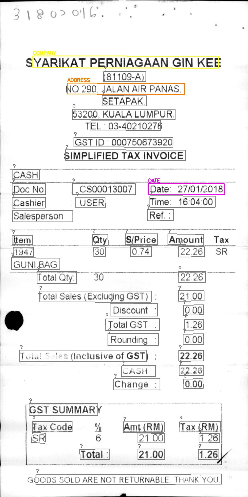

Проект - распознавание информации с чеков с соревнования ICDAR-2019.  

## 0. Структура проекта:
### Задача 1 - детекция текста в BBox на чеке (`.\Task1\...`)
Были обучены следующие виды архитектур
- YoloV8 (20 epoch, 3 M параметров)
- EasyOCR (5 epoch, 2.6 M параметров)
- CTPN (5 epoch, 10,6 M параметров), stride = 8, encoder из первых 23 слоев vga-16 

Сравнительный анализ на тестовой части датасета:

### Задача 2 - перевод или распознование кропа BBox в текст  (`.\Task2\...`)
- CRNN_CTC

Результат: Char accuracy = 0.7735
### Задача 3 - классификация текста (`.\Task3\...`)
- BiLSTM_CRF

Результат: F1 entity score = 0.6873

**Сравниваемые метрики**
Accuracy (Точность), F1  

Итоговая папка, в которой собираем финальное решение со всеми best моделями и показываем совместное решение всех моделей на картинках
